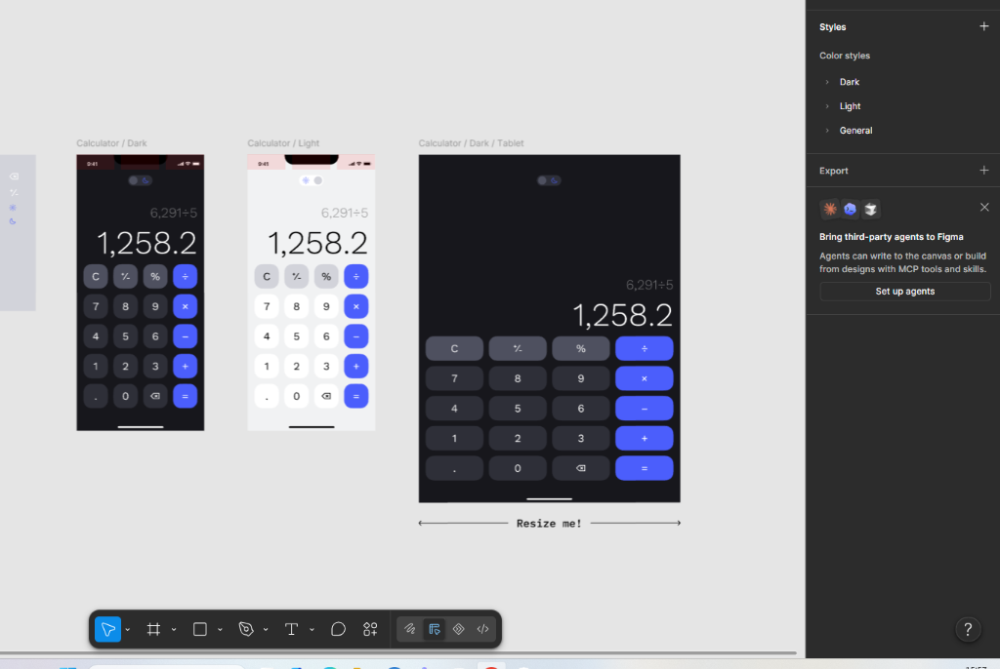

# Calculator (Android / Jetpack Compose)

A modern, responsive calculator application for Android built with Kotlin and Jetpack Compose (Material 3), following Clean Architecture and MVVM / MVI patterns. Designed for seamless experience across mobile and tablet devices with native Light and Dark theme support.

<p align="center">
  
</p>

---

## Overview

This project implements an intuitive, precision-focused calculator application based on a minimalist Figma design. It provides a clean 4x5 grid keypad, real-time formula evaluation, precision decimal arithmetic via `BigDecimal`, and responsive layout scaling for varied screen form factors (handheld phones to tablets).

### Key Specifications

- **Adaptive Theming:** In-app Light and Dark theme toggle switch with animated transitions.
- **Precision Arithmetic:** Arbitrary-precision calculation engine powered by `BigDecimal` to prevent IEEE 754 floating-point inaccuracies.
- **Dual Display:** Secondary expression line for ongoing mathematical operation and primary bold display for current entry and results.
- **Responsive Form Factor:** Proportional key sizing and centered max-width constraint for wide screens and tablets (`Resize me!` capability).
- **Architecture:** Unidirectional Data Flow (UDF) with Jetpack ViewModel and `StateFlow`.

---

## Tech Stack

| Layer | Technology |
|---|---|
| **Language** | Kotlin 2.0+ |
| **UI Toolkit** | Jetpack Compose + Material 3 |
| **Architecture** | MVVM / MVI with Unidirectional Data Flow |
| **State Management** | Android Lifecycle ViewModel + `StateFlow` |
| **Math Engine** | `java.math.BigDecimal` + `MathContext` |
| **Minimum SDK** | API 24 (Android 7.0) |
| **Target / Compile SDK** | API 36 (Android 16) |
| **Build System** | Gradle (Kotlin DSL `.kts`) |

---

## Project Structure

```text
app/src/main/java/com/example/myapplication/
├── data/
│   └── CalculatorEvaluator.kt          # Expression evaluation logic & math operations
├── model/
│   ├── CalculatorAction.kt             # User intent definitions (digits, operations, controls)
│   ├── CalculatorOperation.kt          # Math operators (+, -, ×, ÷)
│   └── CalculatorState.kt              # Immutable UI state representation
├── ui/
│   ├── components/
│   │   ├── CalculatorButton.kt         # Custom squircle keypad button with press states
│   │   ├── DisplayScreen.kt            # Expression & result display with dynamic font scaling
│   │   └── ThemeToggleSwitch.kt        # Interactive pill-shaped theme toggle
│   ├── screens/
│   │   └── CalculatorScreen.kt         # Main responsive screen layout (Mobile & Tablet)
│   ├── theme/
│   │   ├── Color.kt                    # Design tokens for Light and Dark themes
│   │   ├── Theme.kt                    # Custom MaterialTheme implementation
│   │   └── Type.kt                     # Typography system
│   └── viewmodel/
│       └── CalculatorViewModel.kt      # State holder, event handler, business logic connector
└── MainActivity.kt                     # Edge-to-edge entry activity
```

---

## Keypad Layout (4x5)

| Col 1 | Col 2 | Col 3 | Col 4 |
|:---:|:---:|:---:|:---:|
| `C` | `+/-` | `%` | `÷` |
| `7` | `8` | `9` | `×` |
| `4` | `5` | `6` | `-` |
| `1` | `2` | `3` | `+` |
| `.` | `0` | `⌫` | `=` |

- **Number keys (`0-9`, `.`, `⌫`):** Neutral surface color.
- **Function keys (`C`, `+/-`, `%`):** Muted contrast surface color.
- **Operator keys (`÷`, `×`, `-`, `+`, `=`):** High-contrast accent color (`#4B5EFC`).

---

## Build & Installation

### Prerequisites

- Android Studio Meerkat / Ladybug or newer.
- JDK 17 or JDK 21 (or bundled Android Studio JBR).
- Android SDK with platform tools installed.

### CLI Build

```bash
# Clone the repository
git clone <repository-url>
cd Calculator

# Assemble debug APK
./gradlew assembleDebug

# Run unit tests
./gradlew test
```

---

## Development Milestones

1. **Phase 1: Design Tokens & Theming**
   - Palette definition (`Color.kt`) for Dark (`#17171C`) & Light (`#F1F2F3`) palettes.
   - Dynamic theme switcher state integration.
2. **Phase 2: Math Engine & Unit Tests**
   - Implementation of `CalculatorEvaluator` with `BigDecimal`.
   - Comprehensive test coverage for arithmetic, divide-by-zero, negative numbers, and chained operations.
3. **Phase 3: Reusable UI Components**
   - Pill toggle switch, responsive squircle buttons, and auto-scaling numeric display.
4. **Phase 4: ViewModel Integration**
   - UDF flow wiring (`CalculatorAction` -> `CalculatorViewModel` -> `CalculatorState`).
5. **Phase 5: Tablet & Adaptive Optimization**
   - Window size class support, tablet centering, landscape support.

Detailed implementation specifications can be found in [`docs/DEVELOPMENT_PLAN.md`](docs/DEVELOPMENT_PLAN.md).

---

## License

This project is licensed under the Apache License 2.0.
